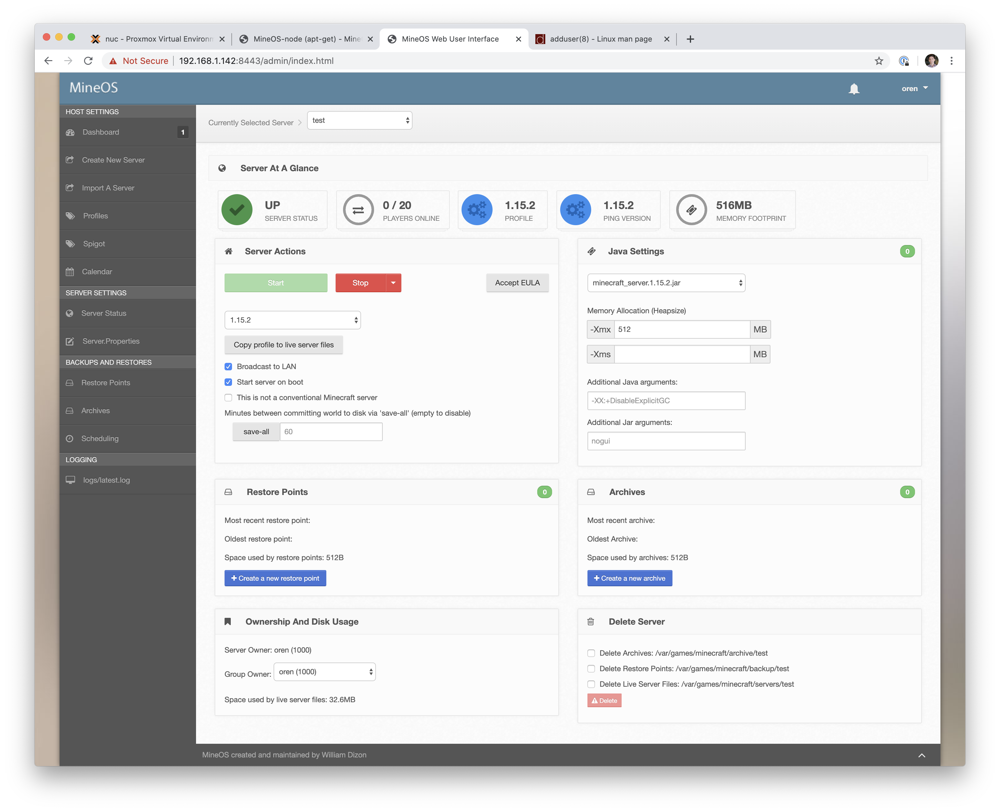

## Setup MineOS

### Notes

* Crete a LXC container based on whatever (I did debian 10).
* Gave it 4 cores. 
* Seems to need at least 512MB of ram for the Minecraft process itself. 
* decent sized world I allocated 2048 to LXC and 1024 each to Xmx and Xms 

### Instructions

From [these instructions](https://github.com/hexparrot/mineos-node)

Create a user to run as
```
useradd -m USERNAME (or adduser USERNAME for interactive)
```

Install mineos
```
apt update
apt-get install -y npm rsync nodejs git rdiff-backup screen build-essential openjdk-11-jre-headless
mkdir -p /usr/games
cd /usr/games
git clone https://github.com/hexparrot/mineos-node.git minecraft
cd minecraft
git config core.filemode false
chmod +x service.js mineos_console.js generate-sslcert.sh webui.js
ln -s /usr/games/minecraft/mineos_console.js /usr/local/bin/mineos
cp mineos.conf /etc/mineos.conf
npm install --unsafe-perm
./generate-sslcert.sh
```

Then enable it

```
cp /usr/games/minecraft/init/systemd_conf /etc/systemd/system/mineos.service
systemctl enable mineos
systemctl start mineos
```

setup some profiles. Here's what my setup screen looked like:

